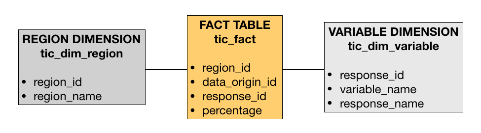

# El Modelo Relacional

En esta sección desarrollaremos un modelo relacional con un esquema de estrella ([star schema](https://es.wikipedia.org/wiki/Esquema_en_estrella)). El diseño de este modelo es fundamental para:

1. Definir las tablas y llaves primarias (primary keys) que estarán en la base de datos.
2. Integrar pasos adicionales de transformación en el pipeline de Bamboo para llevar la data a la estructura requerida antes de ingestar.
3. Escribir un esquema de Tesseract (Tesseract schema) para que `tesseract-olap` pueda interpretar el modelo de datos correctamente.
4. El esquema de Tesseract también influirá sobre Tesseract UI, sobre todo en las operaciones posibles que se podrán realizar sobre el cubo OLAP.

De acuerdo a lo que hemos aprendido de nuestro conjunto de datos, podemos tener una idea de cuáles son nuestras tablas de dimensión y la fact table o tabla de hechos (Que se encuentra al centro del esquema de estrella). Analizaremos nuestras columnas una a una, observando una muestra del archivo tidy que creamos en la sección anterior, la limpieza previa hace todo este proceso más sencillo.

|region  |data_origin|year |variable    |response |percentage |
|:------:|:---------:|:---:|:----------:|:-------:|:---------:|
|Amazonas|INEI       |2007 |Acceso a TIC|No accede|0.798951955|
|Ancash  |INEI       |2007 |Acceso a TIC|No accede|0.560716222|
|Apurimac|INEI       |2007 |Acceso a TIC|No accede|0.818601156|
|Arequipa|INEI       |2007 |Acceso a TIC|No accede|0.392133388|
|Ayacucho|INEI       |2007 |Acceso a TIC|No accede|0.785555358|

* **region**: Esta columna representa una dimensión geográfica de la data y su tipo es `String`, podemos generar una tabla llamada `tic_dim_region` en la base de datos con dos columnas `[region_id, region_name]`, donde `region_id` será la llave primaria, con tipo `Int` y `region_name` tiene el nombre como `String`. La columna `region_id` será la que conecte esta tabla de dimensión con tabla de hechos.
* **data_origin**: En esta columna sólo tenemos dos posibles valores, en este caso, sería recomendable ahorrarnos la creación de una tabla adicional en la base de datos, y definir esta dimensión "inline" cuando escribamos el esquema. Lo que sí debemos hacer es mapear estos valores con 0 y 1 para ahorrar espacio.
* **year**: Como la variable ya tiene tipo `Int` no tenemos muchos cambios que hacer, sólo definir esta dimensión inline en el esquema.
* **variable** y **response**: En este caso, cada `response` depende y es un subconjunto de la columna `variable` anterior. La naturaleza de las columnas sugiere que debemos definir una jerarquía donde `variable` es el nivel superior y `response` el nivel inferior. Crearemos una tabla llamada `tic_dim_variable` con columnas `[response_id, variable_name, response_name]` donde la columna `response_id` será la llave primaria de la tabla de dimensión que conectará con la tabla de hechos.
* **percentage**: Esta columna corresponde a nuestra única medida numérica en el conjunto de datos, debe mantenerse tal como está en la tabla de hechos y se definirá como *measure* en el esquema de Tesseract posteriormente.

Nuestro modelo relacional quedaría de la siguiente forma:

El detalle de las operaciones requeridas en cada caso se encuentra en el Jupyter Notebook `modelo_relacional.ipynb`.