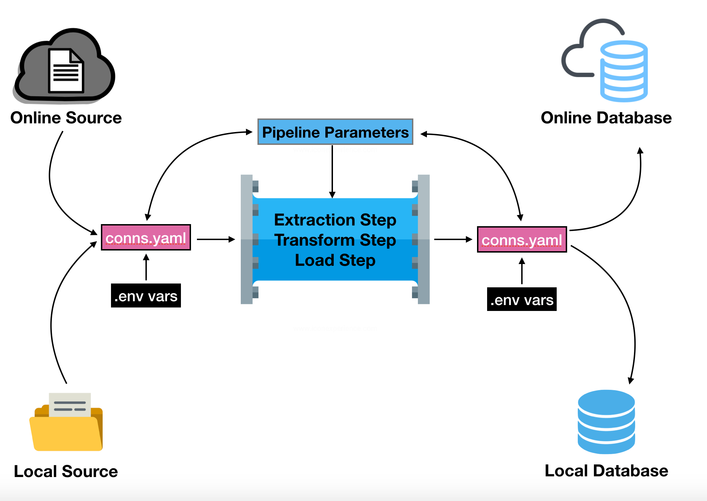

# El Pipeline de Bamboo

Bamboo o `bamboo-lib` es una librería de Python desarrollada en Datawheel por @jspeis, con el objetivo de estandarizar la forma en que escribimos ETL. El formato específico de un pipeline de Bamboo permite identificar fácilmente los pasos que se están llevando a cabo, y posee poderosas clases especiales como `ExtractStep` o `LoadStep` que entablan una conexión con fuentes de datos online, y bases de datos online o locales, evitando tener que escribir estas conexiones manualmente en un script de Python, para utilizarlos sólo se requiere un archivo de conexiones bien configurado (`conns.yaml`) que puede incluir variables de entorno.



Como se puede ver en este diagrama, la fuente de datos puede ser online o local, una carpeta con archivos en tu disco duro, archivos en Google Cloud, una API, etc. Los datos transformados se pueden ingestar en cualquier base de datos soportada por Bamboo (PostgreSQL, MonetDB y ClickHouse).

No existe un límite para la definición de pasos en Bamboo, en el ejemplo no utilizaremos la estructura tradicional de `ExtractStep, TransformStep, LoadStep` sino una definida por nosotros. En Bamboo existen muchas opciones para definir el resultado de un pipeline, explicaré los conceptos del diagrama a continuación.

## Las Variables de Entorno

Las variables de entorno (env vars) son valores con nombres dinámicos que afectan la forma en que se comportan los procesos en ejecución de un computador y son parte del entorno en que un programa se está ejecutando. Las variables de entorno se pueden crear en un archivo `.env` y luego pueden ser activadas con el comando `source` en Linux/MacOS, no estoy familiarizado con el proceso en Windows, pero utilizando WSL (Windows Subsystem for Linux) se puede obtener el mismo resultado.

En este ejemplo, crearé 4 variables de entorno que nos serán útiles en nuestro ejemplo. Asumiendo que vamos a ingestar en ClickHouse, usaremos las variables para definir el usuario, contraseña, URL y nombre de la base de datos:

```
echo "export DB_USER=default;" >> .env
echo "export DB_PW='';" >> .env
echo "export DB_URL='localhost:9000';" >> .env
echo "export DB_NAME=tic;" >> .env
source .env
```

Luego de este proceso podría revisar el valor de cada variable usando la función `echo`, por ejemplo `echo $DB_URL` retornará `localhost:9000`. 

**Nota**: Los archivos `.env` que contengan este tipo de credenciales nunca deben ser incluidos en un commit al repositorio, le estaríamos dando acceso a nuestra base de datos a cualquier persona que pueda ver los archivos en GitHub y sería un problema de seguridad. Es conveniente añadir los archivos `.env` al archivo `.gitignore` para evitar situaciones así.


## El Archivo de Conexiones 

El archivo de conexiones `conns.yaml` en Bamboo posee un listado de fuentes de datos y bases de datos para ingestar, cada conexión tiene un nombre, un driver y un URI (identificador de recursos uniforme). Este es un template de lo que podría encontrarse en el archivo de conexiones:

```
tic-source:
  driver: bamboo_lib.connectors.drivers.http.HttpDriver
  uri: https://data.apideperu.pe/tic/<year>/chart<file_num>.xlsx

clickhouse-local:
  driver: bamboo_lib.connectors.drivers.clickhouse.ClickhouseDriver
  uri: clickhouse://$DB_USER:$DB_PW@$DB_URL/$DB_NAME
```

En este ejemplo mostramos una fuente de datos (API ficticia) donde tenemos dos parámetros `<year>` y `<file_num>`, estos parámetros se pueden definir en el pipeline para que podamos hacer múltiples llamadas a esta API con diferentes valores para `year` y `file_num`. También tenemos una conexión a una base de datos ClickHouse local, es importante notar que utilizaremos los valores de las variables de entorno para generar la URI. El archivo `conns.yaml` se puede integrar sin problemas en un commit, ya que no provee credenciales ni información delicada. Todos los drivers los provee Bamboo.

En nuestro caso de estudio, sólo necesitaremos una conexión a la base de datos, pero me pareció importante comentar la posibilidad de parametrización, el archivo que sí utilizaremos se encuentra en `ETL/conns.yaml`.


## El Pipeline de Bamboo

El pipeline de Bamboo tiene varias secciones:

1. **Bloque de Importación**: Donde importamos las clases de Bamboo que necesitamos y cualquier otra librería adicional.
2. **Definición de Pasos**: Cada `Step` en Bamboo es una clase de Python, existen algunos pasos predefinidos, tales como `DownloadStep` o `LoadStep`, pero en este espacio debemos definir los pasos personalizados que queramos crear.
3. **Esqueleto del Pipeline**: Corresponse a una clase especial de Bamboo, donde definimos los conectores, parámetros, steps y el orden en que serán ejecutados en el pipeline.
4. **Bloque Main**: Es el bloque principal del script de Bamboo, donde crearemos instancias de las clases que definimos anteriormente y podremos ejecutar el pipeline modificando los parámetros si es necesario. También se pueden utilizar ciclos para ejecutar el pipeline con distintas combinaciones de parámetros.

A continuación analizaremos cada parte del script para nuestro caso de estudio.

<details>
<summary>1. Bloque de Importación</summary>

Al principio de este bloque, importamos `pandas`, `os` y `csv` para utilizarlas en el pipeline. El resto de lo importado son clases y funciones específicas de Bamboo. La función `logger` nos permite generar un log e imprime en pantalla lo que escribamos en ella, nos sirve para monitorear cada paso, funciona como un `print()`. La función `grab_connector` crea el Conector de Bamboo para encontrar e ingestar la base de datos definida en el archivo de conexiones. La clase `EasyPipeline` define la estructura del pipeline, `PipelineStep` nos ayuda a crear pasos personalizados y `Parameter` a definir los parámetros. La clase `LoadStep` nos permite hacer uso de un paso predefinido. 

```python
import pandas as pd
import os
import csv

from bamboo_lib.logger import logger
from bamboo_lib.helpers import grab_connector
from bamboo_lib.models import EasyPipeline, PipelineStep, Parameter
from bamboo_lib.steps import LoadStep
```
</details>

<details>
<summary>2. Definición de Pasos</summary>

Separaremos esta sección en algunas partes más específicas. Primero definimos un diccionario que utilizaremos en los distintos pasos que se van a definir.

```python
VARIABLE_DICT = { 
    1: "Acceso a TIC",
    2: "Acceso a Internet",
    3: "Acceso a TV Cable",
    4: "Tipo de Teléfono",
    5: "Empleó Equipos Informáticos",
    6: "Usó Internet",
    7: "Usó Internet para buscar Productos y Servicios",
    8: "Tuvo Problemas de Electricidad"
}
```

Este será nuestro primer paso personalizado, creamos una clase de Python que *hereda* las propiedades de `PipelineStep` y posee una función que se ejecuta al crear una instancia de la clase, más adelante podrás ver que la estructura es igual para cualquier paso personalizado. El paso mostrará un mensaje a través del `logger`, leerá los archivos dentro del diccionario de DataFrames y luego lo retornará. Es importante tener siempre en cuenta lo que entra y sale de cada paso, en este caso entran archivos locales y sale un diccionario de DataFrames.

```python
class OpenStep(PipelineStep):
    def run_step(self, prev, params):
        logger.info("Opening files from source folder...")
        
        df = {i: pd.read_excel("data_source/chart{}.xlsx".format(i)) for i in range(1,9)}
        
        return df
```

Como puedes ver, tenemos casi la misma estructura para este paso personalizado, lo que cambia es el nombre y el código que ejecuta. Algo importante en este paso es que tomará cualquier cosa que provenga del paso anterior (almacenado en la variable `prev`) y pondrá esto en una variable llamada `df`. Aún no hemos definido cuál es el paso anterior, eso es más adelante, pero es importante entender la función de `prev` en cualquier paso de Bamboo. Este paso fue diseñado para recibir un diccionario de DataFrames, guardar un DataFrame único en formato tidy y retornar cero (No queremos retornar nada importante al siguiente paso).

```python
class TidyStep(PipelineStep):
    def run_step(self, prev, params):
        logger.info("Tidying up DataFrame...")

        df = prev

        for i in range(1,9):
            df[i]["region"] = df[i]["region"].str.title()
            
            df[i]["data_origin"] = "INEI" if i in [1,2,3,4] else "ENE"
            
            if i in [1,2,3,4]:
                df[i] = df[i].rename(columns={"censo":"year"})
                df[i]["year"] = df[i]["year"].str[-4:] 
                df[i]["year"] = df[i]["year"].astype(int)
            else:
                df[i]["year"] = 2017
            
            response_col = 2 if i in [1,2,3,4] else 1 
            df[i]["variable"] = VARIABLE_DICT[i]
            df[i]["response"] = df[i].iloc[:, response_col]
            
            df[i] = df[i].rename(columns={"valor_porcentaje": "percentage"})
            
            df[i] = df[i][["region", "data_origin", "year", "variable", "response", "percentage"]]

    
        df_list = [df[i] for i in range(1,9)]
        df = pd.concat(df_list, ignore_index=True)
        df.to_csv("data_temp/tidy_file.csv", index=False, quoting=csv.QUOTE_NONNUMERIC)

        return 0
```

A continuación siguen los pasos que crean las tablas de dimensión. Cada uno leerá una copia nueva del archivo que fue guardado en formato tidy y retornará un DataFrame con la información de la tabla de dimensión. El último paso personalizado leerá el archivo tidy y entregará un DataFrame con la información para la tabla de hechos (Fact Table).

```python
class RegionDimensionStep(PipelineStep):
    def run_step(self, prev, params):
        logger.info("Creating Region Dimension...")

        df = pd.read_csv("data_temp/tidy_file.csv")

        region_list = list(df["region"].unique())
        df_region = pd.DataFrame({"region_id": list(range(len(region_list))), "region_name": sorted(region_list)})

        return df_region


class VariableDimensionStep(PipelineStep):
    def run_step(self, prev, params):
        logger.info("Creating Variable Dimension...")

        df = pd.read_csv("data_temp/tidy_file.csv")

        df_var = df[["variable", "response"]].copy()

        df_var["combined"] = df_var["variable"] + "|" + df_var["response"]
        df_var = df_var[["combined"]]

        df_var = df_var.drop_duplicates().reset_index(drop=True)

        df_var["response_id"] = df_var.index
        df_var["variable_name"] = df_var["combined"].str.split("|").str[0]
        df_var["response_name"] = df_var["combined"].str.split("|").str[1]

        df_var = df_var[["response_id", "variable_name", "response_name", "combined"]]

        return df_var


class FactTableStep(PipelineStep):
    def run_step(self, prev, params):
        logger.info("Creating Fact Table...")

        df = pd.read_csv("data_temp/tidy_file.csv")

        df_reg = pd.read_csv("data_output/tic_dim_region.csv")
        region_map = {k:v for (k,v) in zip(df_reg["region_name"], df_reg["region_id"])}
        df["region_id"] = df["region"].map(region_map)

        origin_map = {"INEI": 1, "ENE": 0}
        df["data_origin_id"] = df["data_origin"].map(origin_map)

        df_var = pd.read_csv("data_output/tic_dim_variable.csv")
        variable_map = {k:v for (k,v) in zip(df_var["combined"], df_var["response_id"])}
        df["combined"] = df["variable"] + "|" + df["response"]
        df["response_id"] = df["combined"].map(variable_map)

        df = df[["region_id", "data_origin_id", "response_id", "year", "percentage"]]

        return df
```
</details>

<details>
<summary>3. Esqueleto del Pipeline</summary>

Sin duda, el bloque más interesante de un pipeline de Bamboo es su esqueleto, la estructura se divide en dos partes, la definición de los parámetros y la de los pasos. El primer paso es darle un nombre al pipeline, para nuestro caso de estudio elegí `TICPipeline`. Luego de que el nombre está definido, se escribe un método estático llamado `parameter_list()`, aquí sólo se puede editar el retorno, en nuestro caso agregamos dos parámetros: uno que permita señalar en qué base de datos del archivo de conexiones queremos ingestar, y otro que indica si queremos ingestar o no.

En la definición de pasos creamos un conector con la ayuda de la función `grab_connector()` de Bamboo. Luego creamos instancias de cada paso que queremos ejecutar, notando que podemos usar `LoadStep` sin haberlo definido porque fue importado desde Bamboo, y sólo tenemos que llenar sus requerimientos. Más abajo, definimos el orden en que se ejecutarán sus pasos, cuando el parámetro `ingest` tenga valor `False` no se ejecutará ninguno de los pasos que ingestan en la base de datos, eso sólo ocurrirá cuando tenga valor `True`.

```python
class TICPipeline(EasyPipeline):
    @staticmethod
    def parameter_list():
        return [
            Parameter("output-db", dtype=str),
            Parameter("ingest", dtype=bool)
        ]

    @staticmethod
    def steps(params):
        db_connector = grab_connector(__file__, params.get("output-db"))

        open_step = OpenStep()
        tidy_step = TidyStep()

        region_step = RegionDimensionStep()
        load_region = LoadStep(
            table_name="tic_dim_region", 
            connector=db_connector, 
            if_exists="drop", 
            pk=["region_id"],
            dtype={"region_id":"UInt8","region_name":"String"},
            nullable_list=[]
        )

        variable_step = VariableDimensionStep()
        load_variable = LoadStep(
            table_name="tic_dim_variable", 
            connector=db_connector, 
            if_exists="drop", 
            pk=["response_id"],
            dtype={"response_id":"UInt8","variable_name":"String","response_name":"String","combined":"String"},
            nullable_list=[]
        )

        fact_step = FactTableStep()
        load_fact = LoadStep(
            table_name="tic_fact", 
            connector=db_connector, 
            if_exists="drop", 
            pk=["region_id"],
            dtype={"region_id":"UInt8","data_origin_id":"UInt8","response_id":"UInt8","year":"UInt8","percentage":"Float64"},
            nullable_list=[]
        )

        if params.get("ingest")==True:
            steps = [open_step, tidy_step, region_step, load_region, variable_step, load_variable, fact_step, load_fact]
        else:
            steps = [open_step, tidy_step, region_step, variable_step, fact_step]

        return steps
```

Sobre el `LoadStep`, puedo detallar un poco más la información a llenar:
* **table_name**: Nombre que tendrá la tabla en la base de datos.
* **connector**: Un conector de Bamboo, en nuestro ejemplo usamos uno generado por `grab_connector`. Cuando pasamos el argumento `__file__`, la función buscará el archivo `conns.yaml` en el directorio actual, si está en otro lugar se debe modificar para que muestre el path correcto.
* **if_exists**: Indica qué se debe hacer si la tabla ya existe en la base de datos. La opción `drop` eliminará la tabla existente y la creará de nuevo con la data que le hayamos entregado al `LoadStep`. Otra opción es usar `append` para agregar la nueva data al final de la tabla sin borrar nada. Si ejecutamos con `append` dos veces tendremos data duplicada, se debe tener cuidado con eso.
* **pk**: Este campo es exclusivo para ClickHouse, pide una llave primaria para cada tabla, se debe entregar el nombre de la llave primaria en una lista.
* **dtype**: Es un diccionario donde se indica el tipo de cada columna en el DataFrame que se está ingestando, si la columna no es del tipo, se intentará forzar una transformación al ingestar. Los tipos de ClickHouse no son los mismos de Python, se puede encontrar más información en el menú lateral de [este sitio](https://clickhouse.tech/docs/en/sql-reference/data-types/).
* **nullable_list**: En esta lista, se deben incluir columnas a las que se les permite tener valores nulos (`NaN`), usualmente es la columna que contiene el valor de la observación, en nuestro ejemplo podría ser `percentage`, pero sabemos de antemano que no tiene valores nulos, por lo tanto no es necesario.
</details>

<details>
<summary>4. Bloque Main</summary>

En el bloque Main indicamos qué es lo que ocurrirá cuando ejecutemos el script de Python. Creamos una instancia del pipeline, y luego usamos el método `.run(params)` del pipeline para ejecutarlo con un diccionario que contenga los parámetros.

```python
if __name__ == "__main__":
    tic_pipeline = TICPipeline()
    tic_pipeline.run(
        {
            "output-db": "clickhouse-local",
            "ingest": True
        }
    )
```
</details>
<br>

El pipeline completo se encuentra en el archivo `tic_bamboo_pipeline.py`, para ejecutarlo correctamente, se deben tener activadas las env vars correctas que conecten con la base de datos de destino, utilizar un entorno virtual de Python con `bamboo-lib` y estar en la carpeta `ETL`.

```
source .env
source venv/bin/activate
(venv) cd ETL
(venv) python tic_bamboo_pipeline.py
```

Luego de ejecutar el pipeline deberíamos tener todas las tablas correctamente ingestadas en la base de datos. Ahora, con ayuda del modelo relacional, podremos escribir un esquema de Tesseract en la próxima sección, disponibilizando toda la data a través del API.